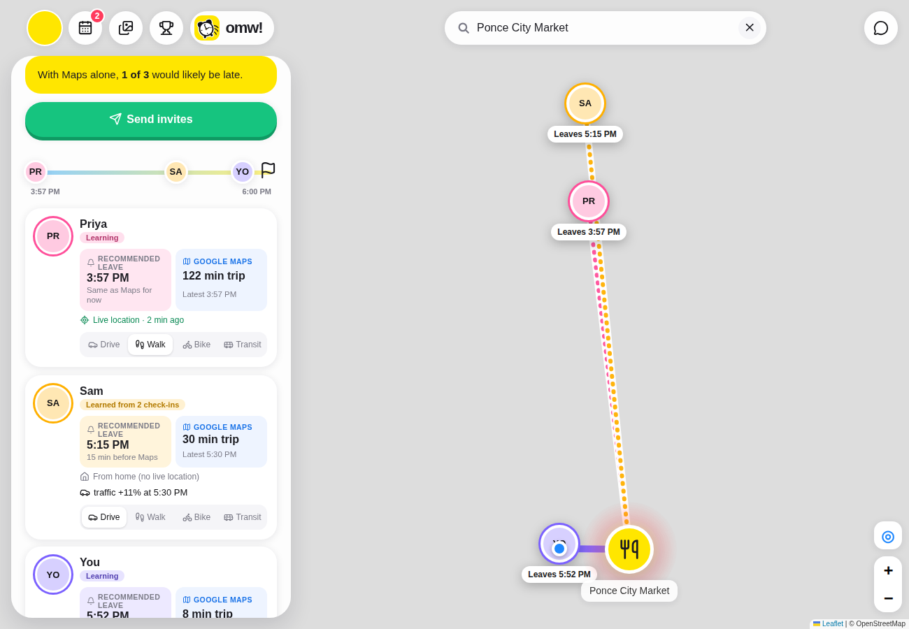

# omw!

**Hang out. Show up on time.**

omw! plans a hangout with your friends and tells each person when to leave, so everyone gets there at the same time.
Google Maps knows how long the trip takes. omw! also knows *when you'll actually walk out the door*, and what the
roads will look like at that moment.



## What it does

- **Plan together.** Pick friends, a spot and a time (or type "boba with Priya Friday"). Everyone gets an invite.
- **A leave time for each person.** Each card shows two times: the *recommended* one, which allows for how late that
  person usually leaves, and the plain *Google Maps* trip time.
- **Starts from where you are.** Trips start from each person's live location (friends only; you can turn this off).
  Leave times update as people move.
- **On the day.** Live map of who's on the way, automatic check-in when you arrive, and a group chat that posts
  "Sam is running late · 1.2 km away" by itself. The chat deletes itself a day after the hangout.
- **Memories.** Once everyone has arrived, someone takes a group photo. It goes on a shared calendar of your hangouts.
- **Your calendar.** Hangouts go straight into Google Calendar, with a reminder at your leave time.

## The two models

### 1. Lateness: when does each person actually leave?

A leave-now alert only helps if people leave when it goes off. Most don't. The lateness model predicts how many
minutes after their alert each person really leaves.

- **Inputs:** time of day, day of week, type of hangout, group size, travel mode, trip length, rain, whether they're
  coming from another event, and a summary of that person's past hangouts (their average, recent trend, spread,
  and how they act in the rain or in the morning).
- **Model:** LightGBM quantile regression (p50 and p90), trained on a time-based split so it's always predicting the
  future from the past (`train.py`, features in `features.py`).
- **The alert** uses the p90: leave early enough to be on time on a bad day.
- **Real people:** until someone has checked in once, omw! doesn't guess, and their alert is the Maps time. After that,
  each check-in teaches it their habit, blended with the model: 5 check-ins count as much as the model (`predictor.learn_from`).

Results on the held-out test set (last 20% of hangouts, synthetic friends from `generate_data.py`):

| Approach | Error predicting when they leave | Everyone arrives within 5 min |
|---|---|---|
| Maps only (assume everyone leaves on time) | 7.6 min | 6.6% |
| Personal average | 4.5 min | 46.9% |
| **omw! model** | **2.8 min** | **85.8%** |

The p90 is well calibrated: 88% of real delays fell at or below it (target 90%).

### 2. Traffic: how slow will the roads be when you leave?

Google Maps predicts traffic for a *departure* time. "Arrive by" doesn't tell you when to go. So for driving,
omw! learns traffic itself and works backwards from the arrival time (`traffic.py`).

- **Data:** real Google Maps drive times (`data/traffic_data.csv`): traffic time, empty-road time and distance.
  Every live driving lookup the app makes adds a row. Only the last 2 weeks are kept, so the model never runs on
  old traffic.
- **What it learns:** how much slower than empty roads a drive is, for every weekday and 15-minute slot, plus extra
  slowdown for rain, heavy rain and snow (past weather from Open-Meteo) and for longer trips. Thin slots borrow
  from nearby times, so one odd reading can't swing it. It retrains every hour.
- **Working backwards:** arrive by 7:00 with a 20-minute empty-road drive → try leaving 6:40 → traffic at 6:40 is
  1.25× → 25 min → try 6:35 → … until the leave time settles.
- **Live vs. predicted:** leaving within 15 minutes uses Google's live traffic, 15–90 minutes out blends the two,
  and further ahead uses the model.

This is for driving only. Nobody walks faster because it's rush hour, but everybody drives slower.

## Run it

```bash
pip install -r requirements.txt
python generate_data.py      # synthetic friends and hangouts for the lateness model
python train.py              # trains it and prints the results above
python traffic.py train      # trains the traffic model on data/traffic_data.csv
uvicorn server:app --reload  # then open http://127.0.0.1:8000
```

`.env` (none are required to try it; features switch on when their key is there):

| Variable | For |
|---|---|
| `GOOGLE_MAPS_API_KEY` | Trip times, place search and names (Routes, Places and Geocoding APIs) |
| `MAPBOX_TOKEN` | Map tiles and fallback search |
| `OPENAI_API_KEY` | AI avatars, and typing a plan in plain words |
| `MUSE_BASE_URL`, `MUSE_API_KEY`, `MUSE_MODEL` | Meta Muse for typed plans (tried first, falls back to OpenAI; `LLM_PROVIDER=openai` skips it) |
| `FIREBASE_SERVICE_ACCOUNT_JSON` | Calendar feeds, and keeping traffic readings across deploys |
| `TRAFFIC_COLLECT_EVERY_MIN` | Optional: check the routes in the traffic data on a schedule (uses Google calls) |

Sign-in, friends, plans, chats and memories use Firebase (Auth + Firestore). Put your web config in
`web/firebase-config.js` and publish `firestore.rules`.

## Where things are

| | |
|---|---|
| `server.py` | The API: plans, trip times, weather, places, calendar feed, AI avatars |
| `predictor.py`, `features.py`, `train.py` | The lateness model |
| `traffic.py`, `travel.py` | The traffic model and trip times (Google Maps, then Mapbox, then a straight-line estimate) |
| `weather.py`, `places.py`, `schedule.py` | Forecasts, place search and names, finding times everyone's free |
| `web/` | The app: `index.html` (planner and map), `friends.js` (profile, friends, plans), `chat.js` and `dms.js` (chats), `memories.js`, `live.js` (live map), `leaderboard.js` |
